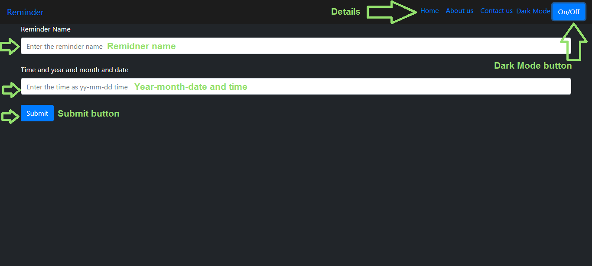

# Reminder
It's remidner application that plays the alarm on time with the name of the alarm

[Open Reminder application](https://muhammedraiyaan2.github.io/Reminder)
# How to use the the Reminder application
First there is a input form in the first input you have to enter the remidner name and in the second input you have to enter the year-month-date and time (in 24 hours)
example 2021-08-24 15:35 and last click on the submit button and there will be a text like setting the alarm... after 2 second the text will change like The alarm has been set for (reminder name). If the alarm has ring then go to the website and then you can remember why you have created the reminder. If the alarm has ring then a text will be there like time up for (remidner name).

# Contact us
If you want to contact us go to the contact section in the header of the right side like contact and click on it and there you can get the contact details
